# Audit Engagement Monitoring System (AEMS) Workflow Design

## 1. Document purpose and status

This document defines the controlled workflows and records the implemented
foundation for the Audit Engagement Monitoring System.
AEMS performs the audit work authorized by an approved Internal Annual Audit
Plan or by an approved special-engagement authority.

The intended operational chain is:

```mermaid
flowchart LR
    IAP[Approved IAP engagement] --> ENG[Engagement Registry]
    SA[Approved special authority] --> ENG
    ENG --> AEO[Audit Engagement Order]
    AEO --> AEP[Audit Engagement Plan]
    AEP --> AP[Audit Program]
    AP --> FW[Fieldwork]
    FW --> WP[Working Papers and Evidence]
    WP --> ISS[Issues and Findings]
    ISS --> MR[Management Response and Rejoinder]
    MR --> EC[Exit Conference]
    EC --> AR[Audit Report]
    AR --> CMS[Final recommendations to CMS]
    CMS --> CLOSE[Engagement Closure]
```

Design status: **operational through the complete child-record workflow and
engagement closure boundary**. Engagement Registry, Audit Team, AEO, AEP, Audit
Program, Working Papers, Audit Evidence, Issues, Findings, Recommendations,
Auditee Responses, Entry/Exit Conferences, Audit Reports, Completion Assessment,
formal Closure, retention/final-index metadata, dashboard progress, and
controlled reopening are implemented with scoped APIs, protected React pages,
immutable versions, audit/activity records, notifications, and tests.

The aggregate engagement transition service and the formal engagement closure
workflow are implemented in the current as-built system. CMS transfer is
idempotent and AIS remains a placeholder module. ARMIS is available through the
replaceable provider boundary, but `IAP_INTERIM_FALLBACK` remains the default
until an explicit reconciliation and authority decision activates another mode.**

The sidebar exposes AEMS as a collapsible module, consistent with IAP:

- `/audit-engagement-management/dashboard` — live AEMS module dashboard;
- `/audit-engagement-management` — Engagement Registry;
- `/audit-engagement-management/team` — Audit Team assignments and warnings;
- `/audit-engagement-management/aeo` — versioned AEO workflow and PDF;
- `/audit-engagement-management/aep` — immutable Audit Engagement Plan;
- `/audit-engagement-management/audit-program` — fieldwork procedure baseline;
- `/audit-engagement-management/working-papers` — Working Papers and Evidence;
- `/audit-engagement-management/issues` — issue capture, review, di smissal, and conversion;
- `/audit-engagement-management/findings` — Findings and Recommendations;
- `/audit-engagement-management/auditee-responses` — management responses and auditor dialogue;
- `/audit-engagement-management/exit-conferences` — schedule, attendance, finding discussions, minutes, files, and acknowledgement;
- `/audit-engagement-management/{engagement}` — complete engagement details.

Legacy placeholder navigation used module code `AEM`. Functional engagement
features use the granular `aems.*` permission namespace and `AEMS`
activity/audit metadata. Legacy `aem.view` remains compatibility-only and must
not authorize a functional AEMS action.

## 2. Workflow design principles

All AEMS workflows follow these rules:

1. Workflow statuses and transition actions are controlled application values,
   not editable Master List items.
2. The backend is authoritative. Hiding a frontend action is not authorization.
3. Every transition validates the current state, actor, permission, engagement
   assignment, office scope, prerequisites, and optimistic lock version.
4. Every transition records actor, date, action, comment, old values, new
   values, request metadata, and the affected record version.
5. Return, rejection, suspension, cancellation, dismissal, override, revision,
   and closure actions require a comment.
6. A preparer cannot approve their own controlled record.
7. An issued, approved, finalized, or closed version is immutable.
8. Corrections to immutable records create a new formal version or revision.
9. Ordinary removal uses soft deletion. Archive state is independent from
   workflow state.
10. Transactions and row locks protect transitions and version generation.
11. Notifications are created only after the underlying transaction succeeds.
12. Historical source links to Core, IAP, documents, and CMS are preserved.

The Core Workflow Management engine may provide responsible-role assignment,
SLAs, reminders, notifications, and immutable instance events. It must not add
or remove AEMS business states. A module-specific AEMS transition service
remains responsible for all cross-record business guards.

## 3. Actors and approval boundaries

| Actor                  | Typical workflow responsibility                                                              |
| ---------------------- | -------------------------------------------------------------------------------------------- |
| CIAS Management        | Authorize engagements, approve/issue controlled documents, finalize reports, approve closure |
| Engagement Supervisor  | Supervise scope, team, quality, findings, and reporting                                      |
| Team Leader            | Prepare engagement records, coordinate fieldwork, review team output                         |
| Reviewer               | Independently review AEO, AEP, programs, working papers, findings, and reports               |
| Assigned Auditor       | Perform procedures, prepare working papers, upload evidence, draft issues                    |
| Auditee Representative | View formally communicated matters, submit management responses, acknowledge conferences     |
| AGIS Administrator     | Maintain configuration and monitor activity; no automatic audit approval authority           |
| Platform Administrator | Technical administration; no automatic audit approval authority                              |
| Read-Only User         | View only specifically authorized final or issued records                                    |

Supervisor, Team Leader, Reviewer, and Auditor are engagement assignments. They
do not require separate platform roles if the user has the required `AGIS User`
or `CIAS Management` role and the corresponding permission.

The same user must not occupy incompatible responsibilities for the same
approval:

- AEO/AEP/report preparer and approver;
- working-paper preparer and final reviewer;
- finding author and final validator;
- management-response author and auditor disposition author.

## 4. Engagement aggregate lifecycle

The engagement aggregate represents the complete audit and summarizes the
progress of its controlled child workflows.

### 4.1 Controlled states

| Code                        | Meaning                                                                      |
| --------------------------- | ---------------------------------------------------------------------------- |
| `DRAFT`                     | Engagement identity and source are being prepared                            |
| `AUTHORIZATION_PREPARATION` | Team and AEO are being prepared                                              |
| `RETURNED_FOR_REVISION`     | The current stage was returned; return context identifies the resume state   |
| `AUTHORIZED`                | AEO is approved and issued                                                   |
| `ENGAGEMENT_PLANNING`       | AEP and Audit Program are being prepared                                     |
| `FIELDWORK`                 | Approved procedures are being performed                                      |
| `FINDINGS_COMMUNICATION`    | Issues, findings, responses, rejoinders, and exit-conference work are active |
| `REPORTING`                 | Draft and final reports are being prepared and reviewed                      |
| `ISSUED`                    | The final report has been issued                                             |
| `CLOSURE_REVIEW`            | Closure requirements are being checked and approved                          |
| `CLOSED`                    | Engagement is complete and locked                                            |
| `SUSPENDED`                 | Work is temporarily stopped; the prior state is retained                     |
| `CANCELLED`                 | Work ended by authorized cancellation before report issuance                 |

`ARCHIVED` is not an engagement workflow state. Archiving sets `deleted_at` and
retains the current workflow status. Restoring an archived record does not
resume, reopen, or change its workflow.

### 4.2 State diagram

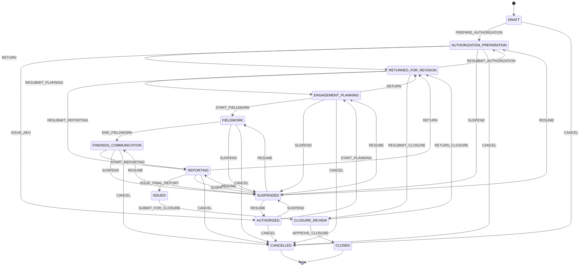

The system stores `returned_from_status`, `return_to_status`, and
`suspended_from_status`. A generic `RESUBMIT` or `RESUME` action may only return
to the recorded valid state; the client cannot choose an arbitrary destination.

### 4.3 Engagement transition guards

| Action                  | Required guard                                                                                                |
| ----------------------- | ------------------------------------------------------------------------------------------------------------- |
| `PREPARE_AUTHORIZATION` | Valid source, auditee office, audit area, dates, type, and preliminary team                                   |
| `ISSUE_AEO`             | Current AEO version is approved and issued                                                                    |
| `START_PLANNING`        | Issued AEO exists and engagement is not suspended/cancelled                                                   |
| `START_FIELDWORK`       | Approved AEP and approved Audit Program exist; required team roles are filled                                 |
| `END_FIELDWORK`         | All required procedures are completed or formally waived; working papers are submitted                        |
| `START_REPORTING`       | Issues are dismissed or converted; communicated findings have response disposition or documented non-response |
| `ISSUE_FINAL_REPORT`    | Final report version is approved, required recipients exist, and confidentiality is assigned                  |
| `SUBMIT_FOR_CLOSURE`    | Final report is issued and recommendation transfer requirements are satisfied                                 |
| `APPROVE_CLOSURE`       | Closure checklist is complete and no blocking workflow remains                                                |
| `SUSPEND`               | CIAS authority, reason, effective date, and resume conditions are recorded                                    |
| `RESUME`                | Original state is valid and resume authority and comment are recorded                                         |
| `CANCEL`                | CIAS authority, reason, disposition of work/evidence, and notification recipients are recorded                |

## 5. Engagement source authorization

An engagement has exactly one source type.

### 5.1 Planned engagement

- References an approved or active IAP plan engagement.
- Retains source plan, prioritization, Audit Universe, risk assessment, office,
  audit area, focus, objectives, preliminary scope, dates, and person-days.
- Stores a source snapshot so later planning revisions cannot silently rewrite
  an active audit.
- One IAP engagement may have only one non-cancelled AEMS engagement unless
  CIAS Management approves a successor or follow-up relationship.

### 5.2 Special or unplanned engagement

- Requires directive number, authority, reason, approving authority, date, and
  supporting document.
- Requires an auditee office, audit area, objective, preliminary scope, risk
  rationale, dates, and estimated resources.
- Must be authorized before engagement planning begins.
- Appears in IAP accomplishment reports as unplanned work without being inserted
  retroactively into an approved IAP version.

## 6. Audit Engagement Order workflow

The Audit Engagement Order (AEO) grants the team authority to conduct the audit.

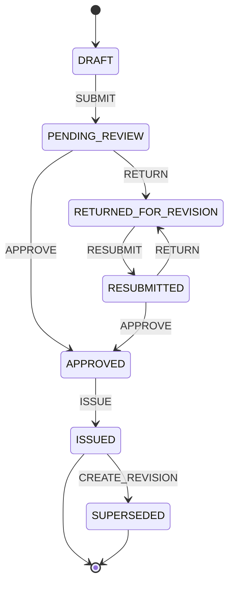

Rules:

- Submission requires engagement authority, auditee, objectives, scope, dates,
  complete team roles, and planned person-days.
- Review may be performed by the assigned Reviewer, Supervisor, or authorized
  CIAS Management user, subject to separation of duties.
- Return requires instructions.
- Approval records the approving authority and approval date.
- Issue generates the official AEO number and locked PDF version.
- An issued AEO cannot be edited, deleted, or overwritten.
- A material change to authority, scope, office, dates, or team creates a new
  version. The previous version becomes `SUPERSEDED` but remains downloadable.
- A minor administrative correction still creates a version and reason.

## 7. Audit Engagement Plan workflow

The Audit Engagement Plan (AEP) defines how the authorized engagement will be
performed.

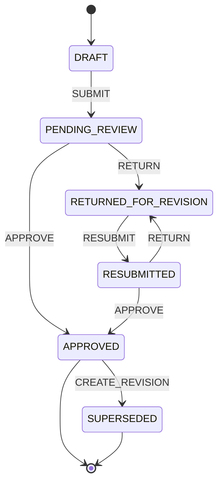

Submission requires:

- an issued AEO;
- objectives and expected outcomes;
- scope and exclusions;
- methodology and audit criteria;
- materiality or sampling approach where applicable;
- schedule and report target date;
- planned person-days and resource requirements;
- identified confidentiality level;
- linked planning risks and required documents.

An approved AEP is immutable. Fieldwork may not begin until the current AEP and
Audit Program are both approved.

## 8. Audit Program workflow

The Audit Program translates the AEP into assigned, reviewable procedures.

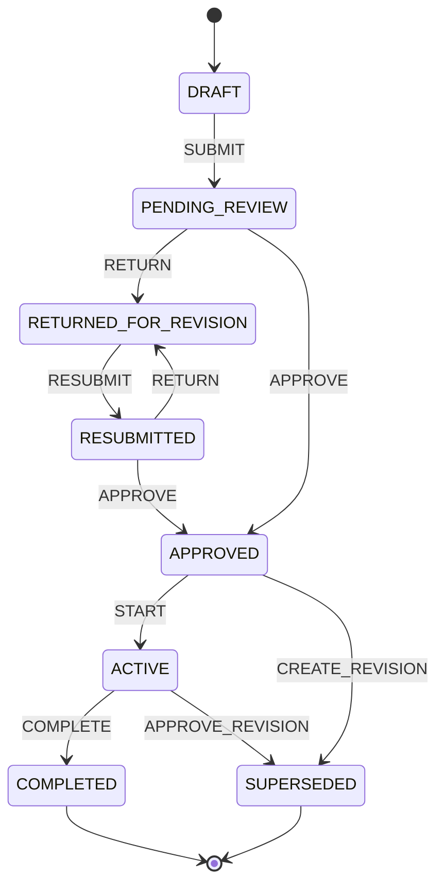

Rules:

- Every procedure has a stable procedure number, objective, description,
  assigned auditor, target date, expected evidence, and working-paper reference.
- Submission requires at least one active procedure and complete assignments.
- Starting fieldwork activates the approved program.
- A procedure may be completed, returned, reassigned, or formally waived.
- Waiver requires Supervisor approval and a reason.
- Program completion requires every procedure to be completed or waived and all
  resulting working papers to have a terminal review disposition.
- Changes to an active approved program create a reviewed revision.

## 9. Working Paper workflow

Working papers document procedures performed, evidence evaluated, results, and
conclusions.

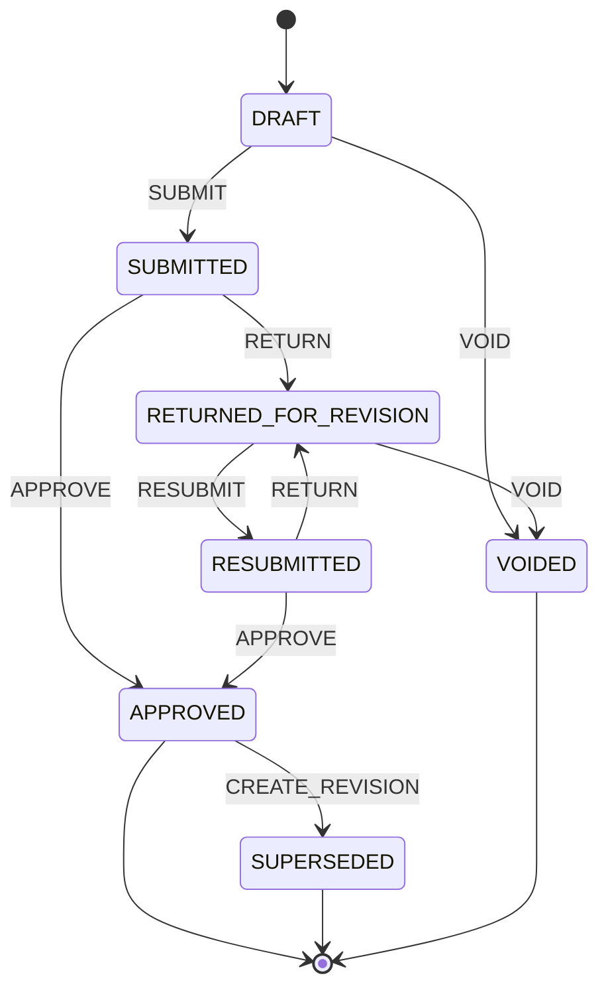

Rules:

- Each working paper has an engagement-unique index and stable family ID.
- Submission requires objective, linked audit procedure, work performed,
  population/sample information when applicable, result, conclusion, preparer,
  and evidence or an explanation that no attachment is required.
- The preparer cannot approve the working paper.
- Return requires reviewer comments.
- Approval locks the content, cross-references, and attached evidence versions.
- A post-approval correction creates a new working-paper version and preserves
  the prior approved version.
- Void does not delete the record. It requires a reason and reviewer authority.
- Findings may cite only approved working-paper versions when validated.

## 10. Audit Evidence governance

Evidence does not use an approval workflow separate from its working paper, but
it has controlled record states:

| State      | Meaning                                                                       |
| ---------- | ----------------------------------------------------------------------------- |
| `DRAFT`    | Uploaded but not yet relied upon by a submitted working paper                 |
| `VERIFIED` | Checksum, source, custodian, date, category, and confidentiality are complete |
| `LOCKED`   | Referenced by an approved working paper, validated finding, or issued report  |
| `VOIDED`   | Retained but explicitly excluded with a documented reason                     |

Evidence files are immutable. A replacement creates a new version with a new
checksum. Locking a working paper stores the exact evidence version IDs it used.
Archive does not remove evidence referenced by an approved or issued record.

## 11. Audit Issue workflow

An Audit Issue is a potential exception raised during fieldwork.

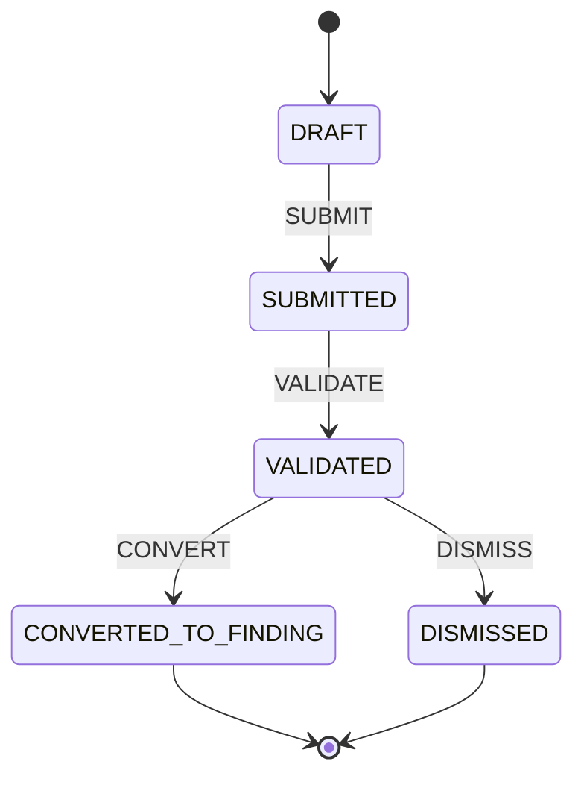

Rules:

- Submission requires an exception statement, responsible office, preliminary
  risk, and at least one linked working paper or evidence record.
- Validation requires the cited working-paper versions to be approved.
- Dismissal requires an independent reviewer, reason, and disposition of links.
- Conversion creates exactly one finding and stores the issue-to-finding link.
- Conversion is idempotent; retrying cannot create duplicate findings.
- A converted or dismissed issue is immutable.

## 12. Audit Finding workflow

A finding formalizes validated criteria, condition, cause, effect, risk, and
recommendations.

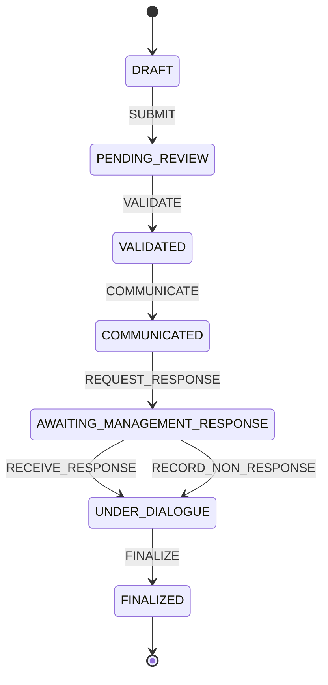

Rules:

- Submission requires criteria, condition, cause, effect, risk rating,
  responsible office, approved working-paper support, verified evidence, and at
  least one draft recommendation or a documented reason for none.
- Validation is performed independently from authorship.
- Communication records recipients, date, due date, confidentiality, and the
  exact immutable finding version sent to the auditee.
- Management can only respond to the communicated version.
- A due-date expiry does not silently finalize a finding. An authorized auditor
  records non-response and continues the dialogue with a comment.
- Finalization requires management-response disposition, auditor rejoinder, or
  documented non-response.
- A finalized finding is immutable and is the only version eligible for a final
  report.

## 13. Management Response and Auditor Rejoinder workflow

Agreement position is record data, not a workflow state. Allowed positions are
`AGREE`, `PARTIALLY_AGREE`, and `DISAGREE`.

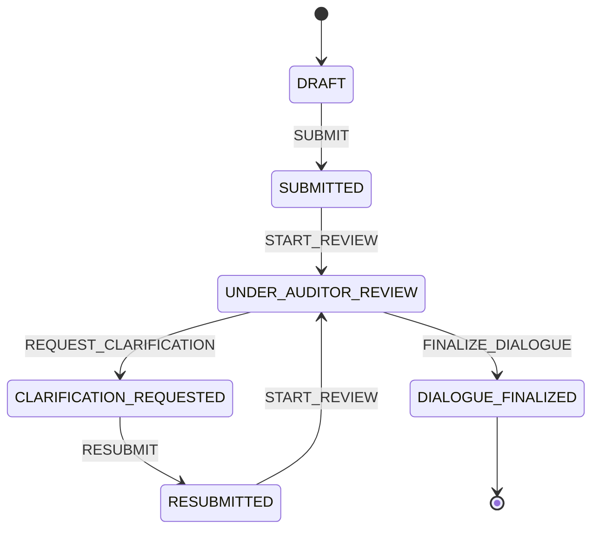

Rules:

- Only an authorized Auditee Representative for the responsible office may
  author or submit a management response.
- Submission requires agreement position, management comment, proposed action,
  responsible person/office, and proposed target date when applicable.
- The submitted response version is immutable.
- Clarification creates a new response version; it does not overwrite the
  submitted response.
- The auditor disposition is `ACCEPT`, `PARTIALLY_ACCEPT`, or `REJECT`.
- Every disposition requires a rejoinder. Partial acceptance or rejection
  requires detailed reasoning.
- Finalization locks the response, rejoinder, action, and agreed target date.
- New dialogue after finalization requires a formal finding revision before
  report issuance.

## 14. Audit Report workflow

One report family contains immutable draft versions and one issuable final
version. Report stage (`DRAFT_REPORT` or `FINAL_REPORT`) is distinct from
workflow state.

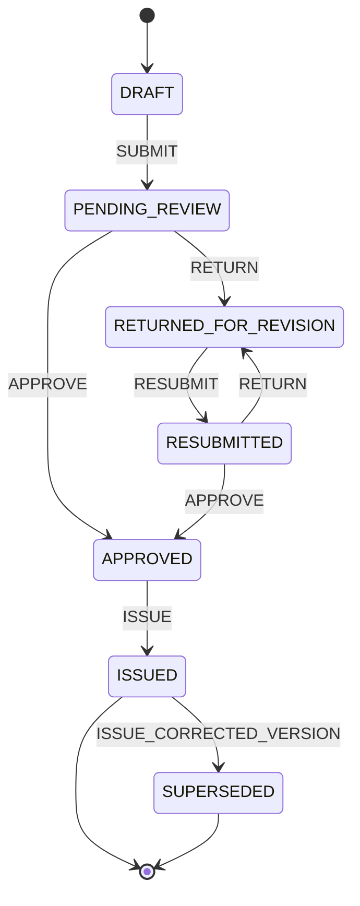

Rules:

- Draft generation selects finalized finding versions and recommendations.
- Each generated file is an immutable report version.
- Return creates reviewer comments against the submitted version.
- Final approval requires complete sections, finalized findings, a completed or
  waived exit conference, confidentiality, approving authority, and recipients.
- The approver cannot be the report preparer.
- Issue assigns the final report number, records recipients and issuance date,
  stores the checksum, locks the version, and advances the engagement.
- An issued report cannot be withdrawn by deletion. Correction requires an
  authorized version that supersedes the earlier version.
- Recommendation transfer to CMS is idempotent and stores the CMS record IDs.

## 15. Engagement Closure workflow

Closure confirms that the engagement is complete, issued, transferred, and
ready for long-term retention.

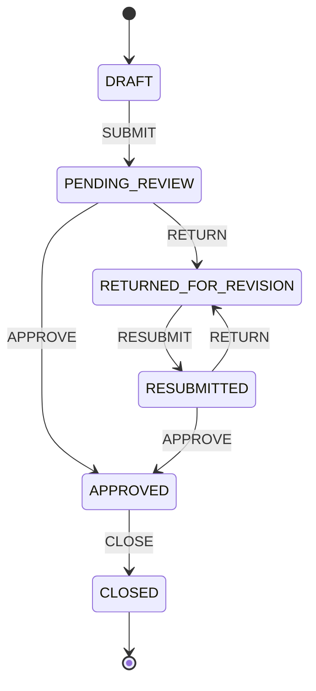

Closure submission requires:

- issued final report;
- complete recipient and issuance records;
- all findings finalized;
- all recommendations transferred to CMS or formally excluded with authority;
- all working papers approved, superseded, or voided;
- all procedures completed or waived;
- exit conference completed or formally waived;
- actual person-days recorded;
- final document index and required retention metadata;
- no active child approval workflow;
- no unresolved required reviewer comment;
- closure summary and lessons learned.

CIAS Management approves closure. Closing the closure workflow sets the
engagement to `CLOSED`. Reopening is exceptional and requires authority, a
reason, a new engagement revision, and complete audit history.

## 16. Suspension, cancellation, return, and archive semantics

### 16.1 Return

Return stores the stage, permitted resubmission state, instructions, responsible
user or role, return date, and due date. Return never unlocks an approved or
issued version.

### 16.2 Suspension

Suspension stores the prior state, reason and authority, effective date,
expected review date, affected deadlines, and recipients. Resume returns only
to the recorded prior state after rechecking prerequisites.

### 16.3 Cancellation

Cancellation is terminal for the engagement revision and records authority,
reason, disposition of work/evidence/findings/documents, IAP impact, and
notifications. An issued engagement follows correction and exceptional
reopening procedures instead.

### 16.4 Archive

Archive is recoverable soft deletion and:

- never erases files, history, or links;
- never changes workflow state;
- requires reason and permission;
- records actor and timestamp;
- does not silently reactivate work when restored.

## 17. Cross-workflow gates

| Engagement milestone   | Required child workflow state                                          |
| ---------------------- | ---------------------------------------------------------------------- |
| Authorization complete | Current AEO is `ISSUED`                                                |
| Fieldwork start        | Current AEP and Audit Program are `APPROVED`                           |
| Procedure completion   | Working paper submitted/approved or waiver approved                    |
| Issue validation       | Working papers `APPROVED`; evidence `VERIFIED` or `LOCKED`             |
| Finding communication  | Finding `VALIDATED`; recipients and due date complete                  |
| Reporting start        | Issues terminal; dialogue finalized or non-response documented         |
| Final report approval  | Included findings `FINALIZED`; exit conference complete/waived         |
| Final report issue     | Report `APPROVED`; number, recipients, confidentiality, and PDF exist  |
| Closure submission     | Report `ISSUED`; CMS transfer/exclusions complete; child work terminal |
| Engagement close       | Closure workflow `APPROVED`                                            |

The backend repeats every gate at transition time. A stale frontend completeness
indicator cannot authorize a transition.

## 18. Controlled states versus Master Lists

The following are controlled values, not editable Master Lists:

- engagement states and actions;
- AEO/AEP/program/working-paper approval states;
- issue and finding workflow states;
- response/rejoinder workflow states;
- report and closure workflow states;
- evidence lock state;
- terminal, return, suspension, cancellation, and immutability semantics.

Master Lists may configure descriptive values that do not alter the state
machine:

- audit type and engagement approach;
- special-engagement authority type;
- evidence category and source type;
- issue category;
- finding risk rating, subject to risk-scale rules;
- management agreement-position labels;
- team assignment title;
- conference participant type;
- report recipient type;
- document type and confidentiality level;
- suspension and cancellation reason category;
- closure checklist category.

Adding a Master List value must never create a backend transition.

## 19. Versioning and immutability

Versioned aggregates use a stable family ID and increasing version number. At
most one current non-archived version exists per family.

| Record              | Lock point                                           |
| ------------------- | ---------------------------------------------------- |
| AEO                 | `ISSUED`                                             |
| AEP                 | `APPROVED`                                           |
| Audit Program       | `APPROVED` and activation                            |
| Working Paper       | `APPROVED`                                           |
| Evidence file       | Every upload; selected versions lock when referenced |
| Issue               | `DISMISSED` or `CONVERTED_TO_FINDING`                |
| Finding             | Communicated version and final `FINALIZED` version   |
| Management Response | `SUBMITTED`; clarification creates a version         |
| Auditor Rejoinder   | `DIALOGUE_FINALIZED`                                 |
| Audit Report        | Every generated version; final lock at `ISSUED`      |
| Closure record      | `CLOSED`                                             |

Revision copies only the data needed for editing and never changes prior files,
references, or history.

## 20. Workflow event contract

Every controlled action writes an immutable event containing:

- event ID and module code `AEM`;
- subject type, ID, family ID, version, and display code;
- engagement ID;
- from state, to state, and action;
- actor, active role/assignment, and office context;
- comment and reason category;
- old-value and new-value snapshots;
- occurrence date, request IP, and user agent;
- optimistic lock version;
- related document/version and notification IDs.

Events are append-only. A correction creates a compensating event.

## 21. Concurrency and idempotency

- Each mutable aggregate has `lock_version`.
- The client sends its last-read version with transition requests.
- The server locks, compares, evaluates guards, writes the event, increments,
  and commits atomically.
- A stale version returns a conflict requiring refresh.
- IAP import, issue conversion, official numbering, report generation, and CMS
  transfer use unique keys and idempotency guards.
- Retrying a successful request cannot create duplicate records.

## 22. Notifications and SLA behavior

Notifications cover assignment, submission, return, approval, issuance,
procedure and working-paper deadlines, finding communication, response
deadlines, clarification, conferences, reports, suspension, cancellation, and
closure. They deep-link to an authorized record and do not expose sensitive
metadata to unauthorized recipients.

Runtime defaults may supply workflow SLAs. Engagement dates take precedence.
Extensions create history and never rewrite the original deadline.

## 23. Access, visibility, and confidentiality

Access is the intersection of account permission, module access, engagement
assignment or oversight, office scope, workflow responsibility, confidentiality,
and record state.

Auditee Representatives see only records formally communicated to their office
and explicitly released documents. They cannot see internal working papers,
review notes, unrelated evidence, draft findings, or internal report drafts.

Read-Only Users do not automatically see AEMS. Platform and AGIS administration
permissions do not imply authority to approve audit judgments.

## 24. Integration boundaries

### Core

AEMS consumes Core users, offices, audit classifications, roles, permissions,
scopes, Master Lists, documents, confidentiality, workflows, notifications,
logs, audit trails, and runtime configuration.

### IAP

AEMS imports only approved/active Annual Plan engagements and preserves lineage
and snapshots. It reports actual dates, person-days, and accomplishment without
editing the approved IAP version.

### ARMIS

ARMIS is implemented as a standalone resource and allocation module. AEMS reads
capacity, competency, requirement, assignment, and actual-person-day data through
the replaceable `ResourcePlanningGateway`. The default provider remains the
IAP-backed interim boundary; shadow and authoritative ARMIS modes are available
only through the documented reconciliation, independent review, and authority
gate. Historical AEMS assignment snapshots remain stable.

### CMS

Only recommendations from finalized findings in an issued report transfer to
CMS. Transfer preserves all source identifiers, responsible office, risk, and
target date.

The downstream CMS-2A backend now exposes permission-scoped dashboard,
registry, detail, and Compliance Monitor assignment APIs over the separate
operational case. It never edits the immutable AEMS intake or source snapshots.
Only AEMS creates recommendation cases; CMS assignment changes do not alter the
AEMS recommendation, report, engagement lifecycle, or closure disposition.
The dedicated CMS-2B React workspace and CMS-3A Action Plan backend now consume
this immutable handoff. AEMS still cannot modify CMS plans or monitoring state.

## 25. Workflow-design acceptance criteria

Step 1 is complete when:

- all ten requested workflows have explicit states and transitions;
- engagement transitions have cross-workflow guards;
- return, suspension, cancellation, archive, revision, and reopening semantics
  are unambiguous;
- separation-of-duties and immutable lock points are identified;
- Master List and controlled-state boundaries are explicit;
- Core, IAP, ARMIS, and CMS integration boundaries are defined;
- concurrency, idempotency, history, notification, confidentiality, and access
  behavior are specified;
- unsupported states cannot be introduced through a dropdown.

## 26. Database foundation

The database foundation implements:

- all 23 requested AEMS entities;
- coverage and evidence/finding/report junction tables;
- a single active AEMS engagement per non-cancelled IAP source;
- PostgreSQL enforcement of planned versus special source authority;
- stable version families for AEO, AEP, working papers, evidence, findings,
  management responses, programs, and reports;
- immutable AEO, AEP, working-paper, and report version models;
- exact Core `document_versions` references and evidence checksums;
- append-only team and engagement event records;
- future CMS transfer keys and external IDs;
- soft deletion for recoverable business records;
- Eloquent relationships spanning the full engagement graph.

`AemsFoundationTest` verifies all tables, the complete model graph, IAP lineage,
evidence relationships, issue-to-finding conversion lineage, recommendation CMS
lineage, and duplicate active-source prevention.

## 27. Permissions and engagement-level access

The permission catalogue now contains 88 controlled AEMS operations grouped
under engagement, team, AEO, AEP, program, working paper, evidence, issue,
finding, management response, rejoinder, conference, and report resources.
Permission codes use the stable `aems.<resource>.<action>` convention.

The standard role baseline is:

| Role                   | AEMS access                                                                                                                                                        |
| ---------------------- | ------------------------------------------------------------------------------------------------------------------------------------------------------------------ |
| CIAS Management        | Global engagement oversight; authorization, assignment, review, approval, issuance, suspension/cancellation, reporting, and closure                                |
| AGIS User              | Only current team assignments; permitted preparation, fieldwork, evidence, issue/finding, response-dialogue, and report-drafting work according to assignment role |
| Auditee Representative | Communicated findings for their office, management responses, covered exit conferences, and issued reports addressed to their user or office                       |
| Read-Only User         | Issued reports only when their user is an explicit report recipient                                                                                                |
| Platform Administrator | Global engagement monitoring and issued-report monitoring; no AEMS audit approval or issuance authority                                                            |
| AGIS Administrator     | Global engagement monitoring and issued-report monitoring; no AEMS audit approval or issuance authority                                                            |

The application enforces access twice:

1. `visibleTo($user)` model scopes restrict collection queries before records
   are serialized.
2. Laravel policies authorize individual engagement, finding, working-paper,
   conference, and report actions.

For AGIS Users, access requires a current, non-ended `engagement_teams`
assignment. Assignment codes further restrict work:

- `TEAM_LEADER` and `SUPERVISOR` coordinate engagement records and plans;
- `AUDITOR` and `TEAM_LEADER` prepare working papers and evidence;
- `REVIEWER` and supervisory assignments perform review actions;
- CIAS Management alone performs controlled approval, authorization, issuance,
  cancellation, archival, and closure actions.

Auditee visibility begins only when a finding is `COMMUNICATED`,
`AWAITING_MANAGEMENT_RESPONSE`, `UNDER_DIALOGUE`, or `FINALIZED`, and the
finding's responsible office matches the user's office. Draft findings,
working papers, internal evidence, and draft reports remain hidden.

Read-only report access requires both `ISSUED` status and a matching
`report_recipients.user_id`. Auditee representatives may additionally match a
recipient office. Administrative global scope exposes only issued report
output, not report drafts.

Independent actions reject the preparer/originator as the actor. This applies
to engagement authorization, review and approval of AEO/AEP/program/working
papers/findings/reports, report issuance, and engagement closure.

`AemsAccessControlTest` verifies the role matrix, assigned-engagement
isolation, administrator non-approval, originator separation, auditee office
and communication boundaries, report-recipient authorization, and exit
conference office coverage.

## 28. Engagement Registry implementation

The functional Engagement Registry is available at
`/audit-engagement-management`, with detail records at
`/audit-engagement-management/{id}`.

Implemented creation paths:

- import one engagement from an approved or active Annual Internal Audit Plan;
- create a separately authorized special or unplanned engagement;
- reject a second import even when the first imported engagement is archived;
- require the special-engagement approving authority to differ from the
  registry creator.

An IAP import copies the working engagement definition and preserves:

- direct foreign keys to the Annual Plan, plan engagement, prioritization item,
  risk assessment, and Audit Universe subject;
- office, audit-area, and audit-focus coverage;
- objectives, scope, exclusions, dates, audit type/approach, and person-days;
- plan code/year/revision/approval;
- ranking decision, rank, priority score, and reason;
- inherent risk, control effectiveness, residual risk, level, justification,
  and criterion scores;
- the Audit Universe subject and source coverage.

The complete source is stored in `source_snapshot` with capture actor, time, and
schema version. Registry updates never rewrite this snapshot, so later IAP
revisions cannot silently alter the historical basis for an active audit.

The API supports permission- and assignment-scoped search, source/status/office/
area filters, whitelisted sorting, runtime pagination, full details, optimistic
updates, soft archive, and restore. Every mutation writes Activity Log, Audit
Trail, and append-only `engagement_events` entries.

`AemsEngagementRegistryTest` verifies historical snapshot stability, direct
lineage, duplicate prevention, special authority separation, filtering,
updates, archive/restore, logs, and assigned-auditor visibility.

## 29. Audit Team and AEO implementation

The Audit Team workspace maintains one active assignment per employee and
engagement. It supports the controlled roles `SUPERVISOR`, `TEAM_LEADER`,
`AUDITOR`, and `REVIEWER`, planned person-days, active assignment dates, notes,
updates, removal, and replacement. Supervisor, Team Leader, and Reviewer are
single-seat roles; multiple Auditors are allowed.

Assignments are recoverable soft-deleted records. `engagement_team_history`
preserves assignment, update, reassignment-from, reassignment-to, and ending
events with actor, reason, and old/new snapshots.

With the default IAP-backed provider, the workspace uses the interim resource
data to warn about:

- missing required team roles;
- assigned versus required person-day differences;
- annual capacity over-allocation;
- overlapping AEMS assignments;
- leave, training, and unavailable dates;
- unmet IAP specialization and proficiency requirements.

Warnings support informed management decisions but do not silently change
assignments.

The AEO workspace implements:

```text
Draft
  -> Pending Review
  -> Returned for Revision -> Resubmitted
  -> Approved
  -> Issued
```

Each content save creates a new `audit_engagement_order_versions` row. Existing
versions cannot be updated or deleted. The version snapshots the exact audit
team, engagement identity, office coverage, audit areas, authority, objectives,
scope, and planned dates.

Submission requires Supervisor, Team Leader, Auditor, and Reviewer assignments.
The current version requires an independent review event before approval.
Preparers cannot review or approve their own AEO. CIAS Management controls
approval, issuance, and formal revision. Optimistic `lock_version` checks reject
stale workflow actions.

Approved/issued PDFs are generated from the exact version referenced by the
approval event. Starting a later revision does not change the historical PDF
source or its recorded approver/issuer.

`AemsTeamAeoTest` verifies team history, reassignment, resource warnings,
independent review, approval and issuance, immutable versions, formal revision,
and approved-version PDF output.

The next implementation step is Exit Conference and Audit Reporting. Every
controller must begin collection queries with `visibleTo($request->user())`
and authorize its record/action policy before invoking a workflow transition.

No frontend approval control should be built until its backend transition,
authorization, guard, event, and concurrency behavior exists.

## 30. Implemented AEP and Audit Program workspaces

The current implementation exposes:

```text
/audit-engagement-management/aep
/audit-engagement-management/audit-program
```

The AEP workspace is available only after the engagement AEO is issued. It
captures objectives, scope and exclusions, methodology, audit criteria,
materiality, sampling, execution and reporting dates, planned person-days,
resource requirements, management coordination, confidentiality, and an
immutable snapshot of the IAP risk assessment, prioritization decision, and
Audit Universe record. Content saves append
`audit_engagement_plan_versions`; an approved version cannot be overwritten.

The controlled AEP actions are:

```text
DRAFT -> PENDING_REVIEW -> RETURNED_FOR_REVISION -> RESUBMITTED -> APPROVED
```

The preparer cannot perform independent review or approval. Approval requires
an independent review event for the exact current version. A change after
approval starts a formal draft revision and retains the approved version.

An Audit Program requires an approved AEP. Each program contains stable,
ordered procedure numbers, objectives, descriptions, expected evidence,
assigned Team Leader/Auditor, target dates, working-paper references,
completion states, waivers, and independent reviewer results.

Program approval establishes the immutable fieldwork baseline:

```text
DRAFT -> PENDING_REVIEW -> RETURNED_FOR_REVISION -> RESUBMITTED -> APPROVED
APPROVED -> ACTIVE -> COMPLETED
```

Definition fields and procedures cannot be edited after approval. During
fieldwork, only progress, working-paper references, waiver dispositions, and
review results change. A material change to an approved or active baseline
creates a new `audit_programs` revision, copies the procedures into the draft
revision, requires a reason, and marks the old revision `SUPERSEDED`. The old
program and its procedure results remain available as historical evidence.

`AemsAepProgramTest` verifies the issued-AEO prerequisite, automatic risk
lineage, independent AEP/program review, immutable AEP versions, program
baseline locking, responsible-auditor progress, independent procedure review,
and documented program revision preservation.

## 31. Implemented Working Papers and Audit Evidence workspace

The fieldwork workspace is available at:

```text
/audit-engagement-management/working-papers
```

Working Papers are linked to procedures in the current active Audit Program and
receive an engagement-unique generated index. Every content save appends an
immutable `working_paper_versions` row containing the objective, procedure
performed, population, sample, results, conclusion, cross-references, preparer,
preparation date, and exact evidence-version links.

The controlled workflow is:

```text
DRAFT -> SUBMITTED -> RETURNED_FOR_REVISION -> RESUBMITTED -> APPROVED
DRAFT or RETURNED_FOR_REVISION -> VOIDED
```

Submission requires complete population/sample documentation and exact
`VERIFIED` or `LOCKED` evidence versions, or a documented explanation that no
attachment is required. The preparer cannot return, void, or approve their own
paper. Approval records the reviewer and date, locks the paper, and changes each
cited verified evidence row to `LOCKED`. An approved paper cannot be edited.
A correction copies the approved content and exact evidence links into a new
draft version while the earlier approved version and event remain immutable.

Evidence records capture evidence category, source type and description, date
obtained, custodian, confidentiality, SHA-256, file size, MIME type, uploader,
verification, Working Paper links, Finding links, and immutable replacement
lineage. Files are private hidden AEMS-owned Core documents. Replacement appends
a new Core `DocumentVersion` and `AuditEvidence` version; it never overwrites or
unlocks the version relied upon by an approved paper.

`AemsWorkingPaperEvidenceTest` verifies active-program and assignment gates,
checksum verification, exact version/evidence locking, preparer separation,
approved-content immutability, correction revisions, evidence replacement,
duplicate checksum rejection, and the Audit Program completion gate.

## 32. Implemented Issues, Findings, and Recommendations workspace

The findings-communication workspace is available at:

```text
/audit-engagement-management/findings
```

Issues receive an engagement-unique index and preserve exact Working Paper
version and evidence links. They follow `DRAFT → SUBMITTED → VALIDATED`, after
which an independent reviewer either dismisses them with a reason or converts
them exactly once to a Finding. Dismissed and converted records are immutable.

Findings record criteria, condition, cause, effect, risk rating, responsible
office, exact approved Working Paper versions, and exact verified evidence.
They follow `DRAFT → PENDING_REVIEW → VALIDATED → COMMUNICATED →
AWAITING_MANAGEMENT_RESPONSE → UNDER_DIALOGUE → FINALIZED`. Validation is
independent from authorship and locks cited verified evidence. Communication
stores recipients, confidentiality, response due date, recommendation content,
and all exact supporting IDs in a snapshot.

Responsible-office Auditee Representatives can author the management response.
Clarification retires the current response and creates an immutable successor
version. Auditors record an `ACCEPT`, `PARTIALLY_ACCEPT`, or `REJECT` rejoinder;
independent finalization locks both response and rejoinder. A documented
non-response is the alternate dialogue gate.

Recommendations remain editable until Finding finalization. Finalization stores
finding and recommendation snapshots, marks recommendations `FINALIZED`, and
prevents content changes while preserving the CMS transfer key and transfer
metadata for the later integration step.

`AemsIssueFindingRecommendationTest` verifies support gates, author/validator
separation, idempotent conversion, evidence locking, communication, auditee
response revision, rejoinder finalization, and finalized recommendation
immutability.

## 33. Implemented Auditee Response workflow

Auditee dialogue has a dedicated workspace:

```text
/audit-engagement-management/auditee-responses
```

Auditee Representatives see only formally communicated Findings whose
responsible office matches their office. They can record agreement, partial
agreement, or disagreement; management comments; proposed corrective action;
responsible personnel; target implementation date; and clarification responses.
Submitted responses are historical versions. A clarification request retires
the current response and creates an editable successor rather than overwriting
the prior exchange.

Authorized auditors can accept, partially accept, reject, request
clarification, add a rejoinder, and independently finalize the dialogue.
Finalization locks the response and rejoinder before the Finding can be
finalized.

Response and rejoinder supporting documents are private. Each upload creates an
immutable Core `DocumentVersion`, records its SHA-256 checksum, size, MIME type,
uploader, and upload date, and pins it to exactly one exchange version through
`aems_dialogue_attachments`. The dialogue API therefore preserves actor, date,
content, attachments, and version for every exchange.

## 34. Implemented Exit Conference management

Exit Conference management has a dedicated workspace:

```text
/audit-engagement-management/exit-conferences
```

Authorized engagement supervisors and team leaders can schedule or reschedule a
physical, online, or hybrid conference; set the agenda; select current formally
communicated Findings; and invite internal or external participants. Auditee
Representatives see conferences covering their office and the Findings directly
linked to each conference.

Completion requires:

- attendance for every invited participant;
- a discussed or not-discussed outcome for every linked Finding;
- agreement, partial-agreement, or disagreement status for each discussed
  Finding;
- details for every partial agreement or disagreement;
- any revised target implementation date;
- a discussion summary and conference minutes.

Completion stores an immutable snapshot containing the schedule, agenda,
attendance, Finding outcomes, agreements and disagreements, revised dates,
minutes, and exact attachment document-version IDs. Completed, cancelled, and
waived conference records are locked.

Minutes files and supporting documents use private storage. Each upload creates
a hidden Core `Document` and immutable `DocumentVersion` with file name, size,
MIME type, SHA-256 checksum, uploader, and upload date. An invited Auditee
Representative can acknowledge completed minutes once, either without
qualification or with reservations. Each acknowledgement preserves actor,
office, date, comment, status, and version and cannot be overwritten.

`AemsExitConferenceTest` verifies communicated-Finding selection, scheduling
and rescheduling, participants, attendance, finding discussions, revised target
dates, immutable files, completion locking, office access, downloads, audit
events, and auditee acknowledgement.
