# AGIS System Flow

## 1. Scope

This document explains the end-to-end behavior of the implemented AGIS platform:
React browser application, Laravel API, PostgreSQL records, private/public file
storage, authorization, reusable services, notifications, Activity Log, Audit
Trail, and runtime configuration.

Detailed business specifications are in:

- [AGIS Core Workflow Design](CORE_WORKFLOW_DESIGN.md)
- [IAP Workflow Design](IAP_WORKFLOW_DESIGN.md)

## 2. System context

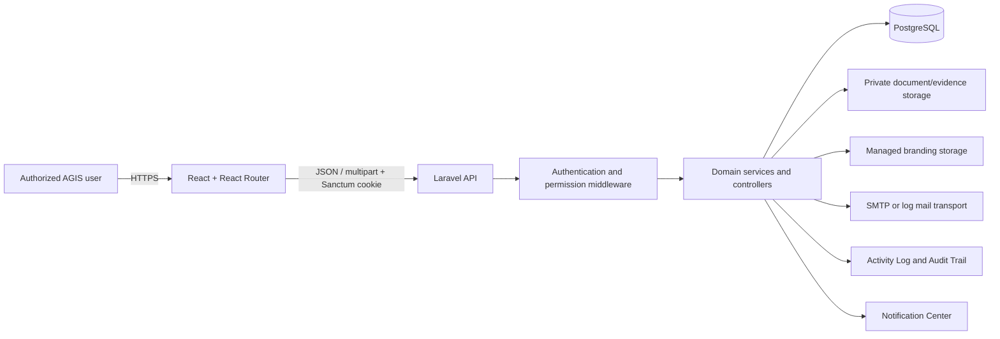

The browser never connects directly to PostgreSQL. React does not decide final
authorization. All protected reads and writes pass through Laravel.

## 3. Technology and directory map

| Layer | Technology | Main location |
| --- | --- | --- |
| Browser UI | React, React Router, Tailwind CSS, Lucide React, Recharts | `src/` |
| API client | Fetch wrapper, CSRF/Sanctum handling, typed service groups | `src/services/api.js` |
| API | Laravel controllers, requests, middleware, resources | `backend/app/Http` |
| Domain rules | Laravel services/support classes | `backend/app/Services`, `backend/app/Support` |
| Persistence | Eloquent and PostgreSQL migrations | `backend/app/Models`, `backend/database/migrations` |
| Seed/reference data | Laravel seeders | `backend/database/seeders` |
| Routes | React route tree and Laravel API routes | `src/App.jsx`, `backend/routes/api.php` |
| Tests | Laravel feature tests and frontend lint/build | `backend/tests`, npm scripts |
| Documentation | As-built guides and standards | `docs/` |

## 4. Application startup flow

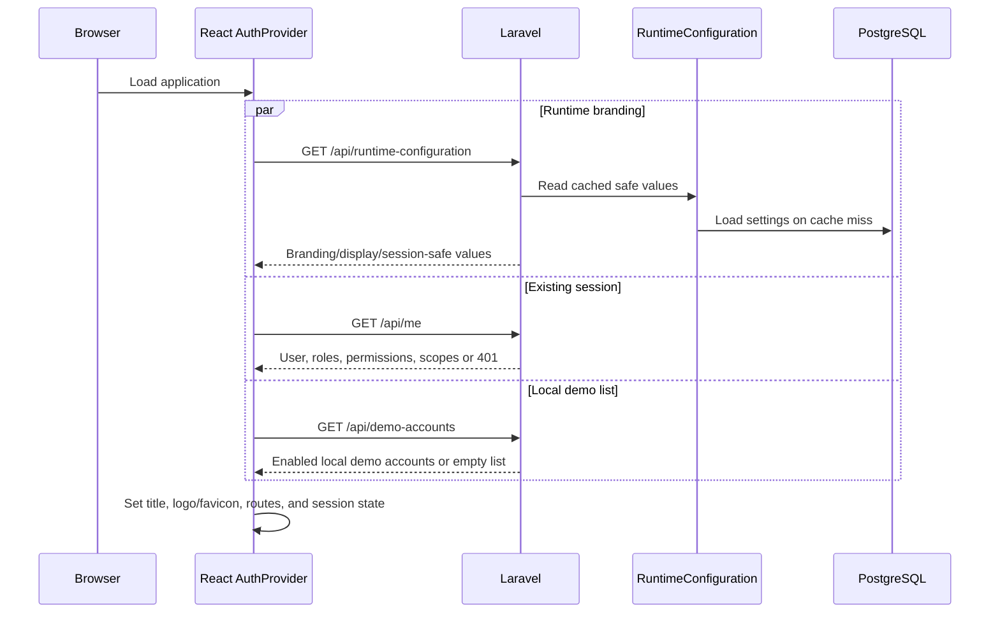

Safe defaults keep the login screen usable if runtime configuration is not yet
available. Public runtime data does not include SMTP credentials, password
secrets, or internal security values.

## 5. Request lifecycle

Every authenticated API request follows this general path:

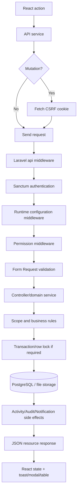

### 5.1 Response behavior

Typical status handling:

| Status | Meaning | Frontend behavior |
| --- | --- | --- |
| `200` | Successful read/update/action | Replace state and show success where applicable |
| `201` | Record created | Add/refresh record and show success |
| `401` | No valid session | Return to login/session-expired flow |
| `403` | Authenticated but not authorized | Show safe permission message |
| `404` | Record/file unavailable or outside safe resolution | Show not-found message |
| `409` or `422` | Conflict, stale state, or validation rule | Display actionable validation/conflict feedback |
| `500` | Unexpected server failure | Show safe generic error; server retains diagnostic details |

## 6. Authentication and authorization flow

Authentication establishes identity. Authorization evaluates:

1. active, non-archived, unlocked account;
2. route permission;
3. effective permissions from all active roles;
4. office scope;
5. engagement or assignment scope;
6. record status/ownership;
7. action-specific business rules.

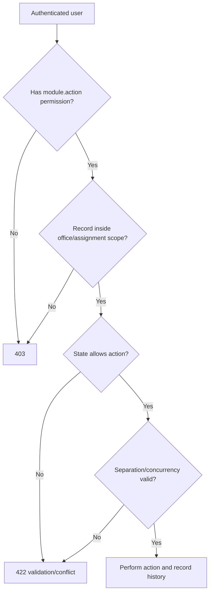

Frontend permission checks must mirror, but never replace, these backend checks.

## 7. Registry list and detail flow

Implemented registry pages use a common interaction:

1. Load the permission-scoped collection and dropdown/reference data.
2. Render summary cards, a large search field, filters, sortable columns, and
   pagination.
3. Click a row to open details.
4. Report the detail view to `POST /api/record-views`.
5. The server validates the associated view permission.
6. The server writes one Activity Log entry per user/record within five minutes.
7. Edit/archive/restore actions use explicit controls and confirmation dialogs.

The five-minute view window avoids false activity created by React rerenders.

## 8. Create and update flow

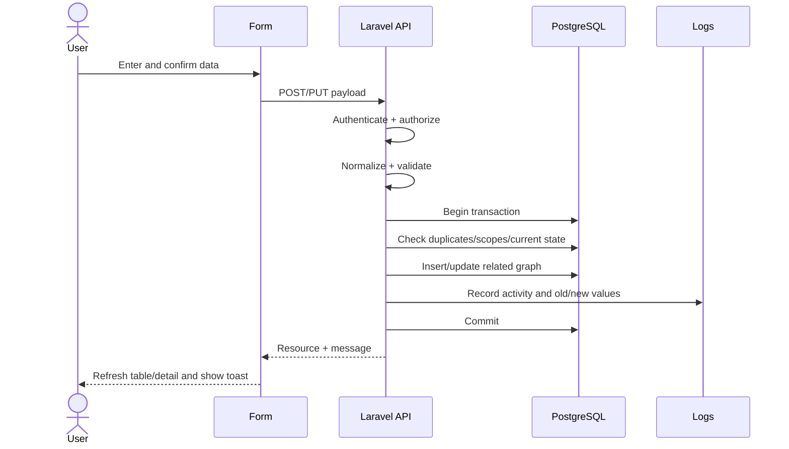

Database unique constraints remain the final duplicate guard even when the form
performs early checks.

## 9. Archive and restore flow

AGIS uses recoverable archive:

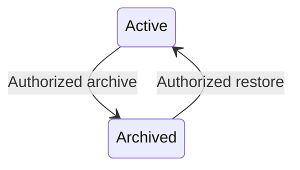

Archive normally sets an inactive state and `deleted_at`, then records history.
It does not delete relationships, files, versions, workflow events, or audit
lineage. Restore resolves the same record ID and reactivates it after validation.

## 10. Controlled approval flow

Module-critical approvals use code-defined transitions:

1. User chooses an allowed action.
2. Frontend sends action, lock version, required comment, and any confirmation.
3. Backend locks the current row.
4. Backend confirms the current status still allows the action.
5. Backend checks permission, scope, completeness, and separation of duties.
6. Backend updates status, actor/date fields, and lock version.
7. Backend creates an immutable event with old/new values.
8. Backend creates Activity/Audit records.
9. Backend delivers an in-app notification and optional email.
10. Transaction commits and the frontend reloads the record.

Reusable generic workflows follow the same principles through workflow
definitions, steps, transitions, instances, and immutable events.

## 11. Document and file flow

### 11.1 Shared document upload

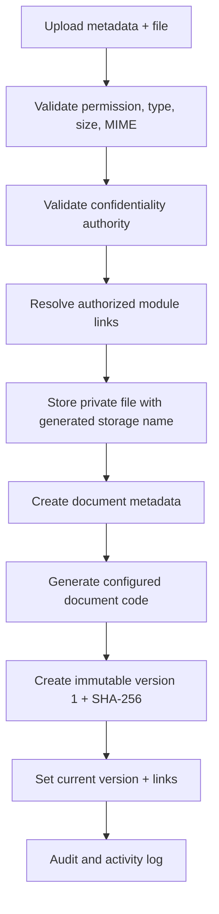

If the database transaction fails after storage, the just-uploaded file is
removed.

### 11.2 New document version

The service stores a new private file, rejects duplicate checksums, increments the
version number under a lock, updates the current-version pointer, and preserves
all earlier versions.

### 11.3 Download

The backend:

1. applies permission middleware;
2. applies confidentiality/ownership policy;
3. confirms document-version ownership;
4. confirms the private file exists;
5. records download activity;
6. streams the file with a safe original filename and MIME type.

No private storage path is exposed as a public URL.

AEMS evidence uses the same private-file boundary. Each upload creates a hidden
module-owned Core `Document` and immutable `DocumentVersion`; an evidence
replacement appends a version and never overwrites the old file. Working Paper
approval stores the exact evidence row and document-version IDs relied upon,
then locks those evidence versions against voiding or mutation.

Validated issues preserve their exact approved Working Paper versions and
verified evidence. Conversion is one-to-one and idempotent. Finding validation
locks cited evidence; communication snapshots the finding, recommendations,
recipients, confidentiality, due date, and support IDs. Finalization locks the
finding, response/rejoinder disposition, and recommendations before later CMS
transfer.

Management-response and rejoinder supporting documents use the same private
document boundary as other protected AEMS files. Every upload creates a hidden
Core `Document` and immutable `DocumentVersion`;
`aems_dialogue_attachments` pins that exact version to one response or one
rejoinder. Dialogue payloads expose the actor, creation/update dates, content,
exchange version, and checksum-bearing attachment metadata without replacing a
prior submitted exchange.

Exit Conference scheduling selects current formally communicated Findings and
internal or external participants. Completion records attendance and a
discussion outcome for every linked Finding, including agreement status,
agreement/disagreement detail, and any revised target date. It then stores a
completion snapshot and locks the schedule, outcomes, minutes, and exact
attachment `DocumentVersion` IDs. Invited Auditee Representatives acknowledge
the completed minutes through immutable, actor- and office-specific
acknowledgement records.

Draft Report generation selects current validated or later Findings, arranges
report sections, and creates a private PDF-backed `DocumentVersion`. Every
revision appends an immutable `AuditReportVersion`; return and approval comments
remain pinned to the exact reviewed version. Final Report generation accepts
only finalized Findings and records confidentiality, approving authority, and
version-bound recipients. Issuance records the date and actor, marks recipients
sent, locks the exact PDF and checksum, and idempotently creates one CMS intake
record for each included finalized recommendation. The intake service
independently revalidates the issued report, exact locked version, included
current finalized Finding, non-archived Recommendation, finalized office/target
source, and existing AEMS issuance authority. Each new immutable intake
initializes one separate `CmsRecommendationCase` in `TRANSFERRED` and one
append-only `INTAKE_CREATED` event. The case is the future operational root; its
CMS monitoring workflow is not implemented yet.

The aggregate lifecycle is now enforced by
`AemsEngagementTransitionService`. A client sends an action and current
`lockVersion`; it cannot send a target status. Laravel policy/permission,
office and assignment scope, separation of duties, row lock, and the
authoritative child records are checked in one transaction before the parent
status changes.

```mermaid
flowchart LR
    D[DRAFT] --> A[AUTHORIZATION_PREPARATION]
    A --> Z[AUTHORIZED]
    Z --> P[ENGAGEMENT_PLANNING]
    P --> E[ENTRY_CONFERENCE]
    E --> F[FIELDWORK]
    F --> C[FINDINGS_COMMUNICATION]
    C --> R[REPORTING]
    R --> I[ISSUED]
    I --> CR[CLOSURE_REVIEW]
    CR --> CA[Completion Assessment APPROVED]
    CA --> CO[Formal Closure APPROVED]
    CO --> CL[CLOSED atomically]
```

The Entry Conference gate reads issued AEO, approved AEP/program, active team
roles, attendance, agenda/briefing, Notes, material-matter dispositions,
acknowledgements, and any exact Core DocumentVersion attachments. Completion or
an independently authorized waiver is required before fieldwork.

### 11.4 AEMS Engagement Tracker derivation

The Engagement Tracker loads only `AuditEngagement` records visible through the
central role-and-assignment scope. It then reads the current AEO, AEP, Audit
Program, Entry Conference, and procedures, Working Papers, Evidence revisions, Findings,
Management Responses, Exit Conferences, Audit Report, recipients, and
recommendations.

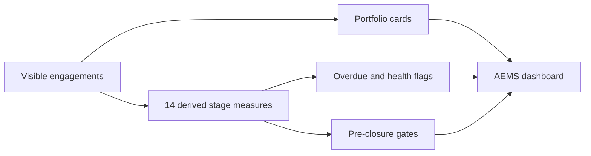

No tracker-owned workflow state is written. Filters and pagination affect the
engagement list; the cards remain totals for the complete visible portfolio.
Pre-closure readiness covers the Entry Conference, enforceable child-work,
issuance, recipient, CMS-transfer, person-day, and review gates. It is advisory.
The formal Completion Assessment and Closure workflows separately evaluate
delivery, generate an authoritative checklist, preserve an exact final document
index, approve retention/custody metadata, record lessons, and authorize the
final `CLOSED` transition. The backend locks and re-evaluates the complete
aggregate in one transaction; a 100% tracker value cannot close an engagement.

The final document index references exact existing private
`DocumentVersion`s—it does not duplicate files. A replaceable
`EngagementRetentionProvider` supplies interim AEMS custody/retention metadata
until Core Records Management replaces that boundary. Exceptional reopening
requires written authority and independent CIAS approval and preserves the
original closed snapshots as history.

### 11.5 AEMS cross-module integration flow

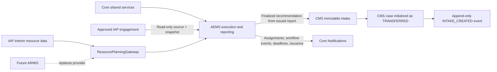

The IAP adapter owns eligibility, locking, and lineage updates; AEMS never
edits approved planning content. The CMS adapter delegates to
`CmsIntakeService`, which owns source eligibility, the unique transfer key,
conflict-safe create-once intake, case initialization, intake event, and AEMS
lineage synchronization. Unique database keys plus insert-ignore/re-query
semantics ensure sequential and concurrent duplicate attempts resolve to the
same source-matching intake. A conflicting immutable identity is rejected.
Formally excluded AEMS recommendations create no CMS intake, case, or event.
The resource contract currently reads IAP capacity, unavailability, skills,
requirements, and AEMS-held person-days. Its provider status explicitly marks
IAP as a non-authoritative fallback; ARMIS will later supply availability,
workload, competencies, and actual person-days through the same contract.

Core services remain shared rather than copied into AEMS. Roles and scopes
authorize access; Master Lists supply descriptive values; Core
`DocumentVersion`s preserve files and checksums; runtime configuration supplies
limits, timezone, pagination, and document numbering; Activity Log and Audit
Trail record mutations; Notifications are queued after successful AEMS
transactions; and the daily reminder schedule detects overdue procedures,
Management Response deadlines, and upcoming Exit Conferences. AEMS keeps
domain-specific transition guards even though the
generic Core workflow engine remains available, preventing configurable steps
from introducing unsupported audit states.

### 11.6 CMS-2A/2B registry and assignment flow

An issued AEMS recommendation creates the immutable CMS intake and its
`TRANSFERRED` operational case; users cannot manually create cases. CMS-2A
reads that case through one database-level visibility scope combining active
account, granular permission (or temporary `cms.view` inquiry compatibility),
role authority, responsible office, active Compliance Monitor assignment,
confidentiality snapshot, and record state.

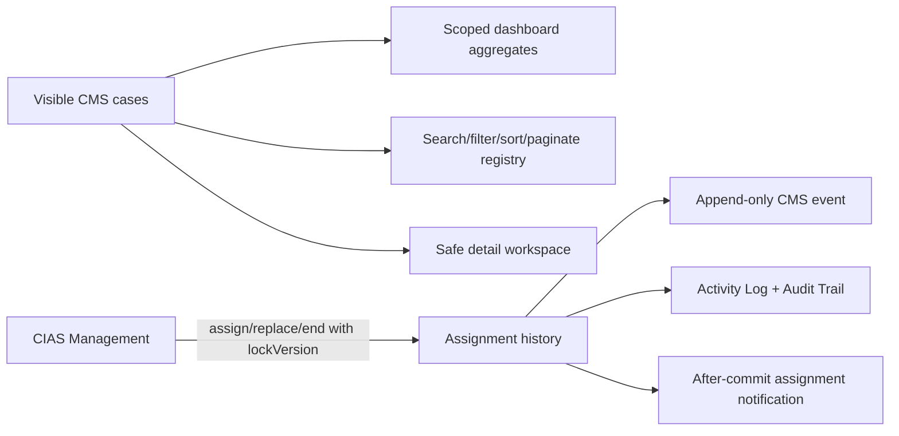

Out-of-scope records resolve as unavailable and do not contribute to totals,
filter options, grouped dashboard counts, or detail-view logs. `OVERDUE` is
derived from the effective target date and evaluation date; it is not stored as
a workflow status. Assignment changes increment the case lock but do not change
its workflow state or grant validation or closure authority.

CMS-2B exposes the scoped backend through dedicated authenticated React routes:

- `/compliance-management` redirects to the CMS dashboard;
- `/compliance-management/dashboard` renders live cards, grouped summaries,
  attention links, recent transfers, aging records, scope, and evaluation time;
- `/compliance-management/recommendations` uses server-side search, filter,
  sort, and pagination with URL-backed filter state;
- `/compliance-management/recommendations/{caseId}` renders the safe overview,
  immutable AEMS lineage, assignments, and event history.

The React shell uses granular permissions for visibility only. Laravel remains
authoritative for record scope and returns inaccessible cases as unavailable.
Monitor assignment, replacement, and ending submit the current `lockVersion`;
stale-state responses explain the conflict and reload the current case. The
due-soon dashboard metric remains visibly unavailable because no approved
runtime threshold exists.

### 11.7 CMS-3A Corrective Action Plan flow

The responsible office creates one Action Plan family for an authorized
recommendation. The initial draft moves the case from `TRANSFERRED` to
`FOR_ACTION_PLAN`. Draft content and milestones remain management-owned.

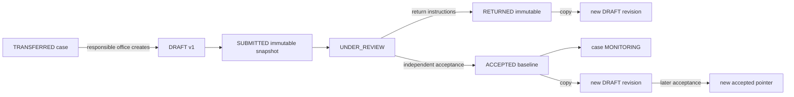

`CmsRecommendationScopeService` remains authoritative. Responsible-office
mutations require matching office and granular permission. Review, return, and
acceptance require an active Compliance Monitor or CIAS Management reviewer who
is independent of the owner office, preparer, focal user, and submitter.

Transactions, row locks, optimistic version locks, unique family/version/active
constraints, immutable snapshots, append-only recommendation events, Activity
Log, Audit Trail, and after-commit notifications preserve the official accepted
baseline. CMS-3B React forms and progress/evidence/validation/extension/closure
workflows are not implemented.

### 11.8 Runtime logo

Branding images are the exception: validated logo files are stored in managed
public storage because the login page must display them before authentication.

## 12. Notification flow

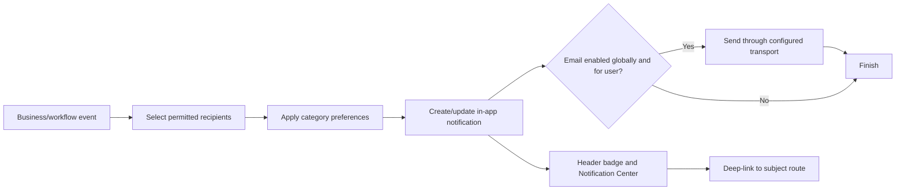

Deduplication keys prevent repeated reminder jobs from creating duplicate
notifications. Email delivery is secondary and non-transactional from the user's
perspective: the in-app record remains authoritative.

## 13. Logging flow

### 13.1 Activity Log

Operational actions create a concise human-readable event plus metadata:

- actor and optional subject user;
- action code and description;
- old/new values when useful;
- IP, user agent, module, record type/ID/code, and route;
- timestamp.

### 13.2 Audit Trail

Significant data changes create a durable delta:

- auditable model and ID;
- action;
- old values;
- new values;
- actor and request metadata.

Exports are themselves logged.

## 14. Runtime configuration flow

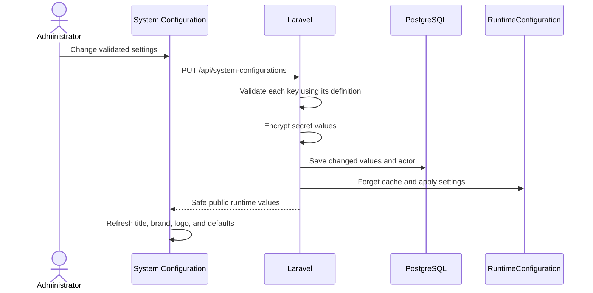

Number-format tokens:

| Token | Meaning |
| --- | --- |
| `{YEAR}` | Current/configured fiscal or record year |
| `{START_YEAR}` | Strategic planning start |
| `{END_YEAR}` | Strategic planning end |
| `{SEQ:n}` | Sequence padded to `n` digits |

Example: `DOC-{YEAR}-{SEQ:5}` becomes `DOC-2026-00042`.

## 15. IAP system flow

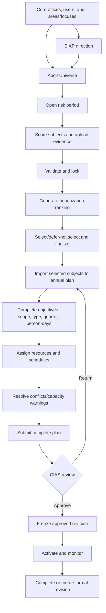

See [IAP Workflow Design](IAP_WORKFLOW_DESIGN.md) for every state and rule.

## 16. Search, sort, filter, and pagination flow

Large registries accept server-side parameters where implemented:

- `search`;
- domain filters such as role, status, office, area, fiscal year;
- `sortBy` and `sortDirection`;
- `page` and `perPage`;
- explicit archive inclusion.

The runtime pagination default is bounded by backend minimum/maximum rules.
Archived records are returned only when the actor has the required management
access.

## 17. Error and concurrency flow

Concurrent controlled records carry `lock_version`:

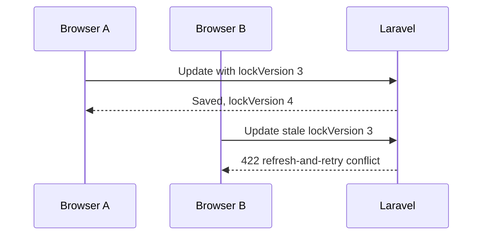

Approval transitions also use database row locks so two approvals cannot both
advance the same old state.

## 18. Seed and reset flow

The ordered seed chain creates:

1. roles and permissions;
2. configurable master lists;
3. offices;
4. audit areas and focuses;
5. system configuration;
6. Core users and optional local demo users;
7. IAP planning data;
8. workflows;
9. notifications.

The demo reset endpoint is restricted to system-configuration administrators and
is intended for local prototype/demo data. Production deployment must disable
demo accounts and protect destructive/reseed operations.

## 19. Testing and release flow

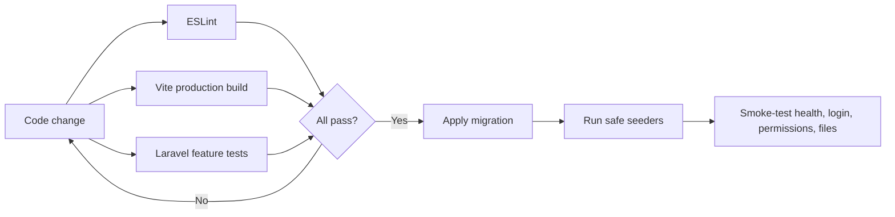

Current standard commands:

```powershell
npm.cmd run lint
npm.cmd run build

cd backend
php artisan test --testsuite=Feature
php artisan migrate --force
```

## 20. Security boundaries

- Use HTTPS outside local development.
- Keep Sanctum cookies HTTP-only and CSRF protection enabled.
- Keep `APP_DEBUG=false` in production.
- Do not place secrets in source, URLs, Activity Log, Audit Trail, or public
  runtime configuration.
- Back up PostgreSQL and both private/public managed storage.
- Enforce upload MIME/size policies and malware scanning when production
  infrastructure is available.
- Monitor lockouts, failed logins, export volume, workflow deadlines, mail
  failures, queue failures, disk usage, and database health.
- Restore tests are as important as backup creation.

## 21. Traceability checklist

Every implemented record flow should be traceable through:

1. frontend route and navigation permission;
2. API service method;
3. Laravel route permission;
4. request validation;
5. controller/domain service;
6. model/table constraints;
7. Activity/Audit event;
8. notification when applicable;
9. feature test;
10. documentation.

If one element is absent, the feature is not fully complete.
